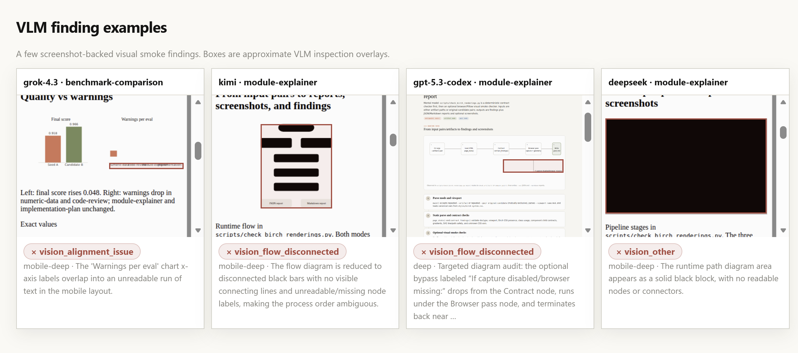
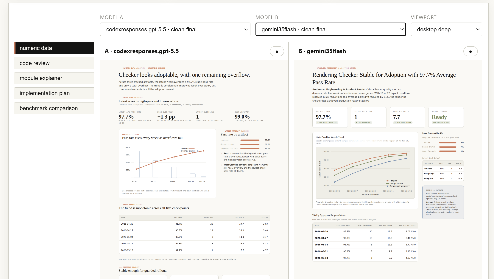
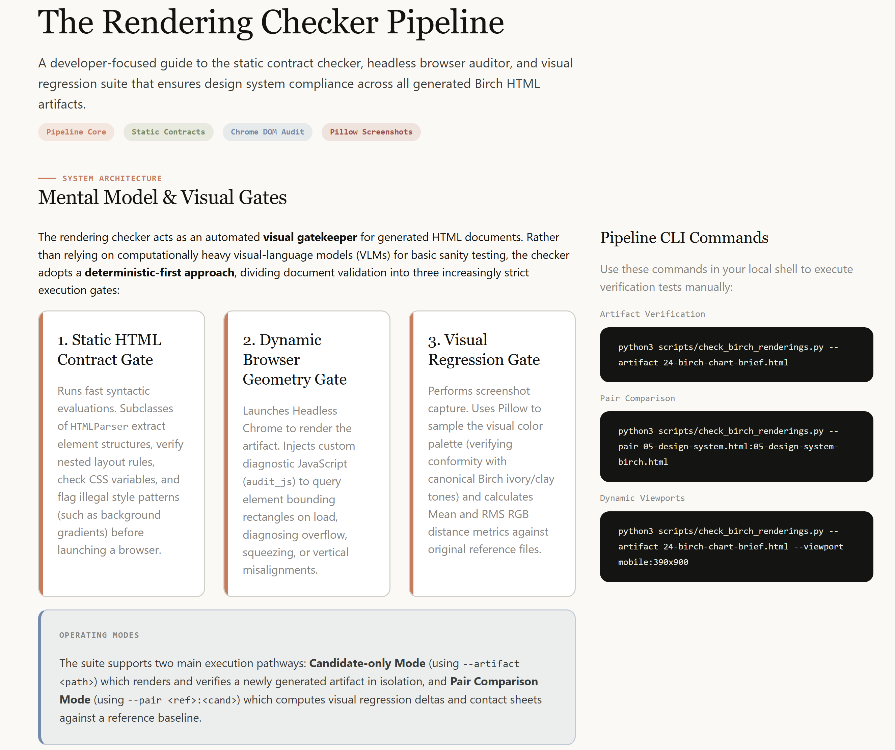

# The Birch HTML Skill

A skill for producing self-contained HTML Artifacts in a consistent visual style. This specific style, and the idea of producing fully self-contained HTML outputs are from:

https://thariqs.github.io/html-effectiveness/
https://github.com/ThariqS/html-effectiveness/

## Screenshots

### VLM checker



### Comparison Report



### Sample Skill Output



## What's Here

- The `birch-html` skill itself.
- An evaluation benchmark that runs both deterministic and visual tests on the generated outputs. The outputs from the released run are included.
- A GEPA loop for candidate experimentation. 

## Why does this exist?

I loved the clean `birchline` style from the "HTML Effectiveness" blog and examples, and wanted to use it myself. It was pretty straightforward to build a stylesheet, and set of rough templates and instructions. The examples shared by @thariqs all had slightly different stylesheets, so i did a bit of merging. 

I was using this as a plugin in `fast-agent` using my session model (usually GPT-5.5) to do the data processing and crunching in a look-ahead turn, and then sending it over to Codex Spark for rendering pointing at the stylesheet. That was quick, efficient and consistent.

But... what about producing good, consistent *standalone* artifacts in a sophisticated common visual style? Turns out to be harder than it looks... 

## What does the Skill do?

Produces visually consistent standalone HTML artifacts, with some standard presentation recipes .

See for yourself: <https://evalstate-birch-html.hf.space/analysis/report.html>.
It has been tested against these models.


This has been benchmarked with 13 different models to see how well they manage to follow the instructions and produce a visually consistent output.

The SKILL.md recommends the model use an HTML template and inject the target CSS rather than reproducing via inference. The skill also recommends, and gives access to the deterministic quality checker the benchmark uses.

A few different approaches have been used while benchmarking - the published set does not include additional guidance or help for the model beyond the skill. This has a negative impact on some models that otherwise performed adequately. I decided to leave this (although they are easily recoverable) as it's a good demonstration of the difficulties of skill engineering and portability.

## How are the scores generated?

Both deterministic and vision model assessments are conducted on the outputs. GPT-5.5 is used as the Vision Model for the checker.

## Should I use this?

There's no reason not to; but I'd say in practice
 - This is an excellent starting point for your own recipes
 - Link to the existing stylesheet in the template; this includes a "cheat" to do a string replacement in the finished artifact to make the models job a little easier.
 - The plugin version described above performs better - having gone through this exercise I'll tidy it up with some of the learnings. 

In it's current form this is more of an art project than a practical tool. The benchmark results _are_ interesting though.

## The GEPA loop

The GEPA loop is good candidate generation and testing; but I wouldn't treat it as a full optimization path. 

This Skill was mainly developed with GPT-5.5. One example of using the loop was to exert pressure on the length of the `SKILL.md` to keep it <~220 lines, specifically for GPT-5.5. (OpenAI, please please fix this).

It's also useful for leaning in to model assumptions; and answering questions like; 
 - Is the `SKILL.md` simply saying "use tailwind classes and this colour theme" more effective? 
 - Is `.mdx` going to mog this approach completely (assumption is yes).
 - What happens if I optimize for a specific model with 20 loops?
 - Can I improve VLM prompting to pick up other defects consistently (e.g. train a VLM assessor against arbitrary inputs) 
 - After manually inspecting different model outputs, can I use the VLM to optimise for my preferences? 

> GPT-5.5 does respond correctly to being told the length of the file early in the `SKILL.md` and reads further chunks :)

### Running GEPA

The active skill loop is:

```bash
uv run scripts/optimize_birch_skill_with_gepa.py --help
```

It mutates only the LLM-facing skill files:

- `skill/SKILL.md`
- selected files under `skill/recipes/`

Each candidate is copied into an isolated directory under:

```text
eval-runs/gepa/<run-name>/candidate-XXX/
```

so failed generations or bad candidates do not modify the working tree.

Quick smoke score of the current seed skill, without proposing changes:

```bash
BIRCH_VISION_REVIEW_CMD=off \
uv run scripts/optimize_birch_skill_with_gepa.py \
  --run-name smoke-seed \
  --task-model codexspark \
  --reflection-model codexresponses.gpt-5.5 \
  --evaluate-only \
  --eval-jobs 2 \
  --generation-timeout 900 \
  --eval-timeout 1800
```

Small GEPA search:

```bash
BIRCH_VISION_REVIEW_CMD=off \
uv run scripts/optimize_birch_skill_with_gepa.py \
  --run-name birch-skill-codexspark-p4 \
  --task-model codexspark \
  --reflection-model codexresponses.gpt-5.5 \
  --proposals 4 \
  --eval-jobs 2 \
  --generation-timeout 900 \
  --eval-timeout 2400
```

Use a previous best candidate as the seed:

```bash
uv run scripts/optimize_birch_skill_with_gepa.py \
  --run-name continue-from-best \
  --seed-skill-dir eval-runs/gepa/birch-skill-codexspark-p4/best/skills/birch-html \
  --task-model codexspark \
  --reflection-model codexresponses.gpt-5.5 \
  --proposals 4
```

The script expects GEPA sources at `~/source/gepa/src` by default. Override with:

```bash
--gepa-src /path/to/gepa/src
```

### GEPA ASI / feedback sources

GEPA scoring and feedback currently use two evidence streams:

1. **Deterministic ASI** — always on. Each candidate runs
   `scripts/run_skill_evals.py`, which generates the five eval artifacts and
   runs `scripts/check_birch_renderings.py` across desktop/mobile/deep
   viewports. Failures and warnings feed `score.json` and actionable feedback.
2. **VLM ASI** — optional screenshot smoke review. By default the GEPA evaluator
   calls `scripts/review_birch_screenshots_with_vision.py` after deterministic
   screenshots exist. VLM findings are surfaced in `score.json` and feedback as
   visual smoke evidence.

Disable VLM review for cheaper deterministic-only loops:

```bash
BIRCH_VISION_REVIEW_CMD=off uv run scripts/optimize_birch_skill_with_gepa.py ...
```

Use the default VLM reviewer:

```bash
uv run scripts/optimize_birch_skill_with_gepa.py ...
```

Or provide a custom reviewer command. It must accept:

```text
<candidate_dir> <reports_dir>
```

and write:

```text
<reports_dir>/vision-findings.json
```

in the same shape as `scripts/review_birch_screenshots_with_vision.py`.

Candidate outputs to inspect:

```text
eval-runs/gepa/<run-name>/candidate-XXX/artifacts/
eval-runs/gepa/<run-name>/candidate-XXX/reports/
eval-runs/gepa/<run-name>/candidate-XXX/score.json
eval-runs/gepa/<run-name>/best/
```


## Active layout

| Path | Purpose |
|---|---|
| `styles/birch-system.css` | Canonical Birch CSS tokens, layout primitives, and semantic components. |
| `docs/birch-llm-style-guide.md` | LLM-facing Birch generation contract. |
| `docs/birch-recipes/` | Recipe guidance for common artifact types. |
| `scripts/birch-copy.js` | Optional browser enhancer for copyable code/command blocks. |
| `scripts/birch_mpl.py` | Matplotlib helpers for Birch-styled chart generation. |
| `scripts/check_birch_renderings.py` | Static/browser rendering checker for Birch artifacts. |
| `scripts/run_skill_evals.py` | Single-model skill benchmark runner. |
| `scripts/run_multimodel_skill_evals.py` | Multi-model benchmark runner. |
| `scripts/optimize_birch_skill_with_gepa.py` | GEPA loop for skill/recipe candidate experiments. |
| `evals/` | Prompt fixtures, sources, and rubrics for the eval harness. |
| `eval-runs/` | Committed baseline and comparison artifacts. |


## Running checks

Run one benchmark model:

```bash
uv run scripts/run_skill_evals.py \
  --model codexspark \
  --label smoke-codexspark \
  --jobs 2
```

Run the multi-model benchmark:

```bash
uv run scripts/run_multimodel_skill_evals.py \
  --experiment my-run \
  --model codexspark \
  --model codexresponses.gpt-5.5 \
  --vision \
  --jobs 2
```

Regenerate and publish the browsing site to Hugging Face:

```bash
hf auth login
scripts/publish_hf_space.sh
```

The publish helper rebuilds `results/clean-final` and `analysis/report.html`,
syncs the static payload to `hf://buckets/<hf-user>/birch-html`, and uploads a
small Docker Space that mounts the bucket read-only and serves the report.

Current published URL:

```text
https://evalstate-birch-html.hf.space/analysis/report.html
```

Useful overrides:

```bash
HF_NAMESPACE=evalstate scripts/publish_hf_space.sh
LABEL_SUFFIX=publish-run scripts/publish_hf_space.sh
DRY_RUN=1 scripts/publish_hf_space.sh
```

Run the Birch rendering checker directly against generated artifacts:

```bash
uv run  scripts/check_birch_renderings.py \
  --artifact eval-runs/skill-baseline-gpt55/numeric-data.html \
  --out reports/birch-rendering-check.json \
  --markdown reports/birch-rendering-check.md
```

Use `--pair reference.html:candidate.html` only when there is a meaningful
reference artifact; eval-generated artifacts use candidate-only visual smoke
checks rather than same:same screenshot comparisons.

The checker writes generated reports/screenshots to `reports/` by default. That
folder is intentionally not part of the clean top-level baseline; historical
outputs live in `archive/generated-reports/`.

## Attribution and license

This project includes code and materials derived from the original "HTML Effectiveness" 
project by **Thariq Shihipar / Anthropic PBC**.

The original project is licensed under the Apache License, Version 2.0. This
repository is also distributed under the Apache License, Version 2.0. See
[`LICENSE`](LICENSE) for details.

Modifications in this repository include:

- SKILL.md, and associated evaluation and harness scripts
- benchmark result packaging;
- deterministic/VLM report consolidation;
- generated analysis tables;
- SVG figures;
- static HTML report microsite;
- publication-oriented documentation.

Where source files retain original copyright or license notices, those notices
have been preserved.
